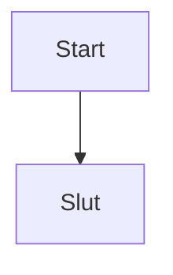

# geany-mermaid — Mermaid diagram preview for Geany

Finds the Mermaid blocks in the active document, renders them with
**mmdc** (mermaid-cli) and shows the diagrams in a plugin window.

```markdown
# My document


```

Both notations are recognised:

* fenced blocks — ```` ```mermaid ```` … closing fence,
* mermaid's own tags — `@startmermaid` … `@endmermaid`.

Fenced blocks with any other info string (` ```python `, ` ```bash `) are
ignored, and every Mermaid block in a document is rendered, in order.

## Requirements

| | |
|---|---|
| Geany | 2.x (`geany` + `geany-dev`, GTK3) |
| mmdc | mermaid-cli, e.g. `npm install -g @mermaid-js/mermaid-cli` |

On the workstations mmdc/chromium come from the `workstation.md2pdf` Salt
state — if `mmdc` is missing the plugin says so in the status bar and writes
the reason to its log.

Rendering runs **locally**: the document text is already in Geany's buffer, so
there is no reason to send it anywhere. (Compare `geany-pfiles`, where the
*file* lives on another machine and the expansion has to happen there.)

## Build & install

```sh
make                 # -> geany-mermaid.so
sudo make install    # -> /usr/lib/x86_64-linux-gnu/geany/
```

On the workstations this is deployed by Salt (`workstation/geany`), which
fetches `vertelab/geany-odoo` and builds every plugin in it.

**Never keep a second copy** of the same plugin in a user plugin directory:
Geany 2.1 scans both `~/.config/geany/plugins` and
`~/.local/share/geany/plugins`, and a duplicate `plugin_init` crashes Geany.

## Usage

* **Mermaid** toolbar button, or
* the keybinding *Förhandsgranska Mermaid* (default
  `Ctrl+Shift+M`, changeable under *Preferences → Keybindings → geany-mermaid*).

The preview window has:

| | |
|---|---|
| **Uppdatera** | render the active document again |
| **Spara PNG…** | save the first diagram as PNG |
| **− / +** | zoom 25 % … 400 % |
| status line | result, or the reason it failed |

Rendering is asynchronous and queued one diagram at a time; a failing diagram
does not stop the following ones. `mmdc` output and errors go to
`~/.config/geany/geany-mermaid/log.txt`.

Diagrams are rendered to a private temporary directory which is removed when
the next render starts and when the plugin shuts down.

## Settings

*Edit → Plugin Manager → geany-mermaid → Preferences*, stored in
`~/.config/geany/geany-mermaid/geany-mermaid.conf` (0600):

```ini
[mmdc]
command=mmdc
puppeteer_config=/etc/md2pdf/puppeteer-config.json

[render]
theme=
background=
width=1400
scale=2
on_save=false
on_activate=false
```

* **puppeteer_config** — passed as `-p` only when the file exists;
  `/etc/md2pdf/puppeteer-config.json` is what the md2pdf Salt state installs
  so the headless Chrome inside mmdc can run as root/without a sandbox.
* **theme** / **background** — passed as `-t` / `-b` only when non-empty, so
  mmdc's own defaults apply otherwise.
* **on_save** — re-render when the document is saved, if the window is open.
* **on_activate** — render automatically whenever a document is activated
  (live preview while writing).

## Why PNG and not SVG

Geany does not depend on librsvg, so `GdkPixbuf` cannot be assumed to load
SVG. mmdc renders PNG natively, and `gtk_image_new_from_pixbuf()` needs no
extra dependency at all.

## Notes

* Processes are spawned with `g_spawn_async_with_pipes()` + `GIOChannel` +
  `g_child_watch_add()`; `g_spawn_sync()`/`popen()`/`waitpid()` deadlock inside
  Geany's main loop and are never used.
* The plugin makes itself resident and destroys its toolbar item in
  `plugin_cleanup()` so it can be disabled/enabled in the Plugin Manager.
